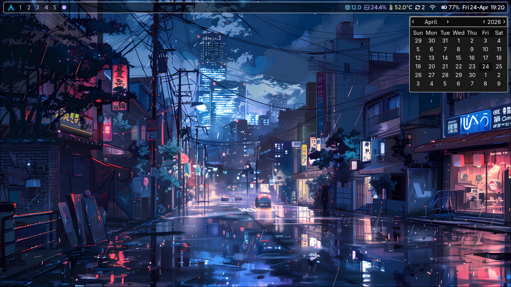

# hypr_bar [](https://opensource.org/licenses/MIT)

A personal status bar for [Hyprland](https://hyprland.org/), built with [EWW](https://github.com/elkowar/eww) (Elkowar's Wacky Widgets). Similar in concept to [Waybar](https://github.com/Alexays/Waybar), but written entirely in EWW's declarative Yuck language with SCSS styling — giving full control over layout, widgets, and appearance without being tied to Waybar's component model.

> **Note:** This is a personal configuration, not a general-purpose framework. It is designed to be used as a git submodule inside a dotfiles repo, living at `~/.config/eww/hypr_bar/`.




---

## Layout

The bar sits at the top of the screen, anchored center, spanning ~99% of the screen width with a 5px top gap.

```
┌─────────────────────────────────────────────────────────┐
│  [Arch Logo]  [1] [2] [●] [4] [5]  │            │  CPU  RAM  Temp  Updates  WiFi  Bat  Time │
└─────────────────────────────────────────────────────────┘
                Left                       Center                        Right
```

### Left
| Widget | Description |
|---|---|
| Arch Logo | Static Arch Linux icon, styled in Arch blue (`#1793d1`) |
| Workspaces | Clickable buttons for workspaces 1–5 (always shown), plus any extra open ones. Active workspace shows a `●` dot; clicking switches to that workspace |

### Center
Reserved — empty by default, ready for an active window title or any future widget.

### Right
| Widget | Description |
|---|---|
| System Stats | CPU usage %, RAM usage %, CPU package temperature — each with a Nerd Font icon and a dynamic color-coded state |
| Updates | Total pending update count (pacman + yay). Hover tooltip shows the pacman/AUR split |
| WiFi | Shows connection icon; click to toggle WiFi on/off. Hover shows the connected SSID |
| Battery | Icon + percentage. Pops up a dismissible warning overlay at ≤ 30% while discharging |
| Time / Date | `Day DD-Mon  HH:MM`, updated every 10s. Hover opens a GTK calendar popup |

---

## Dependencies

**Required:**
- [`eww`](https://github.com/elkowar/eww) — the widget daemon (wayland branch)
- `hyprctl` — part of Hyprland; used for workspace data
- `nmcli` — NetworkManager CLI; used by the WiFi widget
- `lm_sensors` — provides the `sensors` command for CPU temperature
- `bash`, `awk`, `grep`, `sed`, `free`, `top`, `date` — standard coreutils
- A [Nerd Font](https://www.nerdfonts.com/) — all icons are Nerd Font glyphs

**For the updates widget:**
- `pacman` — Arch Linux package manager
- `yay` — AUR helper (replaceable with `paru` or any `-Qu`-compatible helper)

> No `jq` dependency — all JSON is built and parsed with `awk`, `grep`, and `sed`.

---

## File Structure

This repo is designed to live inside a larger EWW config directory as a submodule. The full dotfiles context it was built for looks like this:

```
~/.config/
├── eww/
│   ├── eww.yuck                    ← (include "hypr_bar/hypr_bar.yuck")
│   ├── eww.scss                    ← @use 'hypr_bar/style.scss'
│   └── hypr_bar/                   ← this repo (git submodule)
│       ├── hypr_bar.yuck           # Window definitions: hypr_bar, cal_popup, low_batt_warning
│       ├── widgets.yuck            # All defwidget, defpoll, defvar definitions
│       ├── style.scss              # All SCSS styling
│       ├── README.md
│       ├── LICENSE.md
│       └── scripts/
│           ├── battery.sh          # Reads /sys/class/power_supply/BAT0
│           ├── system_stats.sh     # CPU %, RAM %, CPU temp via sensors
│           ├── updates.sh          # Pending updates via pacman -Qu and yay -Qu
│           ├── wifi.sh             # WiFi status and toggle via nmcli
│           └── workspaces.sh       # Active + open workspaces via hyprctl
├── hypr/
│   └── hyprland.conf               # exec-once launches eww daemon + bar
└── scripts/
    └── reload.sh                   # Super+R keybind — kills and reopens the bar
```

The root `eww.yuck` and `eww.scss` each contain a single line pointing into the submodule. All window definitions, widgets, styles, and scripts live entirely within `hypr_bar/` — the submodule is self-contained.

---

## How It Works

### The EWW data flow

Every widget follows the same pattern:

```
shell script → outputs JSON → defpoll reads it → defwidget renders it → style.scss styles it
```

For example, the battery widget end-to-end:

```
battery.sh  →  {"icon":"","level":"72","class":"Discharging"}
       ↓
(defpoll battery-data :interval "5s" "scripts/battery.sh")
       ↓
(defwidget battery []
  (label :text "${battery-data.level}%"
         :class "${battery-data.class}"))   ← "Discharging" becomes the CSS class
       ↓
.battery_container .Discharging { color: whitesmoke; }
```

All five scripts follow this same contract: **output one line of JSON per run**, with keys that widgets reference directly via EWW's `${variable.key}` syntax.

### File include chain

EWW loads a single entry point — `eww.yuck` in the config root. From there:

```
eww.yuck
  └── (include "hypr_bar/hypr_bar.yuck")
        └── (include "hypr_bar/widgets.yuck")   ← all defpoll, defvar, defwidget

eww.scss
  └── @use 'hypr_bar/style.scss'                ← all widget styles
```

`hypr_bar.yuck` holds only `defwindow` blocks — the three named windows EWW can open: `hypr_bar`, `cal_popup`, and `low_batt_warning`. `widgets.yuck` holds all data definitions and widget logic. Keeping them separate means you can add a new popup window without touching widget code, and vice versa.

### Bar layout — centerbox

The bar uses EWW's `centerbox` as its root, which gives three slots where the center is **always truly centered** regardless of how wide the left or right sides are:

```lisp
(centerbox :orientation "h"
  (box :halign "start" ...)    ; Left  — Arch logo + workspaces
  (box :halign "center" ...)   ; Center — empty / reserved
  (box :halign "end" ...)      ; Right — stats, updates, wifi, battery, time
)
```

This is why the time widget stays flush-right even as the workspace buttons change width.

### Dynamic CSS state classes

System stats (CPU, RAM, temp) use a pattern where the shell script maps a number to a CSS class name string — no conditional logic in Yuck at all:

```bash
# system_stats.sh — the script decides the class
cpu_state=$(echo "$cpu_usage" | awk '{
  if ($1 < 30) print "cpu-idle"
  else if ($1 < 70) print "cpu-moderate"
  else         print "cpu-critical"
}')
```

```lisp
; widgets.yuck — the class is just another JSON value
(label :text "${System_data.cpu_usage}%"
       :class "${System_data.cpu_state}")
```

```scss
// style.scss — one rule per state
.cpu-idle     { color: #74c7ec; }
.cpu-moderate { color: #f9e2af; }
.cpu-critical { color: #f38ba8; }
```

Adding a new threshold is one line in the script and one line in the stylesheet.

### Workspace widget

`workspaces.sh` always includes workspaces 1–5 as a baseline, merged with whatever is actually open in Hyprland. This ensures the row never collapses below 5 buttons, even on a fresh session with only workspace 1 open:

```bash
all_workspaces=$(echo "1 2 3 4 5 $workspaces" | tr ' ' '\n' | sort -nu | ...)
```

The widget loops over the resulting array and renders one button per entry. The active workspace gets `ws-active` (renders `●`); everything else gets `ws-inactive` (renders the number). Clicking dispatches `hyprctl dispatch workspace <id>`.

### Low battery popup

The battery script does more than report data — it also opens a second EWW window directly when needed:

```bash
# battery.sh
if [ "$level" -le 30 ] && [ "$status" = "Discharging" ] && [ ! -f "/tmp/eww_batt_warning_shown" ]; then
  eww open low_batt_warning
  touch "/tmp/eww_batt_warning_shown"   # flag prevents repeated popups
fi

# Reset flag when charging or battery recovers above 30
if [ "$status" = "Charging" ] || [ "$level" -gt 30 ]; then
  rm -f "/tmp/eww_batt_warning_shown"
fi
```

`low_batt_warning` is a separate `defwindow` in `hypr_bar.yuck` with `stacking "overlay"`. It contains a dismiss button that runs `eww close low_batt_warning`. The flag file at `/tmp/eww_batt_warning_shown` ensures the popup appears once per discharge cycle and doesn't spam on every 5s poll.

### Calendar popup

The time widget uses an `eventbox` to react to hover:

```lisp
(eventbox
  :onhover     "eww open cal_popup"
  :onhoverlost "sleep 0.3 && eww close cal_popup 2>/dev/null"
  (label :class "time" :text time_poll))
```

`cal_popup` is a separate `defwindow` anchored to `top right`, containing EWW's built-in `calendar` widget powered by EWW's own `EWW_TIME` variable — no extra script needed. The 0.3s sleep on `onhoverlost` prevents the popup from closing before your mouse reaches it after leaving the time label.

---

## Implementation — Hyprland Integration

### Autostart

The bar is launched automatically on login via `hyprland.conf`:

```ini
exec-once = eww daemon; eww open hypr_bar
```

`exec-once` ensures this runs only on Hyprland startup, not on every `hyprctl reload`. The daemon is started first, then the bar is opened — the semicolon means they run sequentially in the same line so the daemon is ready before `open` is called.

### Reload keybind

A reload script at `~/.config/scripts/reload.sh` handles cleanly restarting the bar without restarting Hyprland:

```bash
#!/bin/bash
eww kill
eww open hypr_bar
```

This is bound to `Super + R` in `hyprland.conf`:

```ini
bind = $mainMod, R, exec, ~/.config/scripts/reload.sh
```

Use this whenever you make changes to `widgets.yuck`, `style.scss`, or any script — EWW hot-reloads config on `eww open` after `eww kill`. Note that `Super + R` also has a second binding to `hyprctl reload` in the config, so both Hyprland and EWW reload together on that key.

### Monitor setup

The current setup runs on two displays:

```ini
monitor = , preferred, auto, auto          # laptop display (eDP-1) — auto resolution
monitor = HDMI-A-1, 3840x2160@70, 0x0, 1  # external 4K TV at 70Hz, positioned left
```

The bar currently opens on the default monitor via `eww open hypr_bar`. Since `hypr_bar.yuck` does not specify a `:monitor` property, EWW places the bar on whichever monitor is primary. To explicitly target a monitor or open bars on both displays, see the Customization section below.

### Wallpaper

Wallpapers are managed by [`swww`](https://github.com/LGFae/swww), set per monitor at startup:

```ini
exec-once = swww-daemon
exec-once = sleep 1 && swww img ~/wallpapers/static/w1.jpg --output eDP-1
exec-once = sleep 1 && swww img ~/wallpapers/static/w1.jpg --output HDMI-A-1
```

The 1s sleep gives `swww-daemon` time to initialize before setting the image.

---

## Installation

### As a submodule (recommended)

```bash
# From your dotfiles root
git submodule add https://github.com/VishwajeetKeni/hypr_bar.git path/to/.config/eww/hypr_bar
```

Set up the two root EWW files:

```lisp
; ~/.config/eww/eww.yuck
(include "hypr_bar/hypr_bar.yuck")
```

```scss
// ~/.config/eww/eww.scss
@use 'hypr_bar/style.scss';
```

### Standalone clone

```bash
git clone https://github.com/VishwajeetKeni/hypr_bar.git ~/.config/eww/hypr_bar
```

Then create `~/.config/eww/eww.yuck` and `~/.config/eww/eww.scss` as shown above.

### Make scripts executable

```bash
chmod +x ~/.config/eww/hypr_bar/scripts/*.sh
```

### Add to Hyprland autostart

```ini
# ~/.config/hypr/hyprland.conf
exec-once = eww daemon; eww open hypr_bar
```

### Optional — reload keybind

Create `~/.config/scripts/reload.sh`:

```bash
#!/bin/bash
eww kill
eww open hypr_bar
```

```bash
chmod +x ~/.config/scripts/reload.sh
```

Bind it in `hyprland.conf`:

```ini
bind = $mainMod, R, exec, ~/.config/scripts/reload.sh
```

---

## Customization

**Change poll intervals** — edit the `:interval` values in `widgets.yuck`. `wifi-data` is `1s` by default; `5s` is plenty for most use cases.

**Change the color theme** — all colors are in `style.scss`. The state classes (`cpu-critical`, `mem-high`, etc.) are independent rules, so remapping to a different palette is a straightforward find-and-replace on hex values.

**Use a different AUR helper** — replace `yay` in `scripts/updates.sh` with `paru` or any helper that supports `-Qu`.

**Different CPU sensor** — run `sensors` to find your chip name. AMD systems typically use `k10temp` instead of `coretemp-isa-0000`. Update the chip name and the `grep "Package id 0"` filter in `scripts/system_stats.sh`.

**Different battery device** — run `ls /sys/class/power_supply/` to find your battery name (e.g. `BAT1`), then update the paths in `scripts/battery.sh`.

**Open bar on a specific monitor** — add `:monitor` to the `defwindow` in `hypr_bar.yuck`:

```lisp
(defwindow hypr_bar
  :monitor 0          ; 0 = primary, 1 = secondary, etc.
  ...)
```

**Add a new widget** — write a script in `scripts/` that outputs JSON, add a `defpoll` + `defwidget` in `widgets.yuck`, place the widget in the left/center/right box in `hypr_bar.yuck`, and style it in `style.scss`.

---

## Styling

All styles are in `style.scss` using SCSS. The color palette is [Catppuccin Mocha](https://github.com/catppuccin/catppuccin):

```scss
#cba6f7  // Mauve   — active workspace, tooltip borders, calendar buttons
#cdd6f4  // Text    — inactive workspaces
#89b4fa  // Blue    — cpu-low state
#a6e3a1  // Green   — temp-normal state
#f9e2af  // Yellow  — temp-warm state
#fab387  // Peach   — temp-hot state
#f38ba8  // Red     — cpu-critical, temp-crit state
#1793d1  // Arch blue — logo
```

The bar background is `rgba(black, 0.5)`. Hyprland's blur is already enabled in the config (`blur { enabled = true }`). To apply it to the EWW layer specifically, add these layer rules to `hyprland.conf`:

```ini
layerrule = blur, eww
layerrule = ignorezero, eww
```

---

## Troubleshooting

**Bar doesn't appear**
Run `eww logs` to check for errors. Confirm the include path in your root `eww.yuck` is `"hypr_bar/hypr_bar.yuck"` and that the repo is at `~/.config/eww/hypr_bar/`.

**Changes not reflected after editing files**
Run the reload script or do it manually:
```bash
eww kill && eww open hypr_bar
```
EWW does not hot-reload in the background — a kill/reopen is required.

**Widgets show no data**
Make sure scripts are executable and test them directly in a terminal:
```bash
bash ~/.config/eww/hypr_bar/scripts/battery.sh
```
Each script should print one line of JSON to stdout with no errors.

**Temperature shows nothing**
Run `sensors` and check that `coretemp-isa-0000` with a `Package id 0` field exists. If your system uses a different chip (common on AMD), update the sensor name and grep filter in `scripts/system_stats.sh`.

**Battery widget missing**
Run `ls /sys/class/power_supply/` — if your battery is `BAT1` or named differently, update the paths in `scripts/battery.sh`.

**Updates widget hangs EWW**
`yay -Qu` contacts AUR servers and can be slow. The script wraps it in `timeout 30`. Increase this on a slow connection, or remove the `yay_u` lines entirely if you don't use an AUR helper.

**Calendar popup doesn't close cleanly**
The 0.3s sleep on `onhoverlost` is intentional to prevent the popup flickering closed before your mouse reaches it. Reduce it carefully — below `0.1s` the popup tends to close before you arrive.

---

## License

MIT License — see [LICENSE.md](LICENSE.md) for details.
Copyright (c) 2026 Vishwajeet Keni

---

## Acknowledgements

- [EWW](https://github.com/elkowar/eww) by ElKowar — the widget framework
- [Hyprland](https://hyprland.org/) — the compositor
- [Catppuccin](https://github.com/catppuccin/catppuccin) — color palette
- [Nerd Fonts](https://www.nerdfonts.com/) — icons
