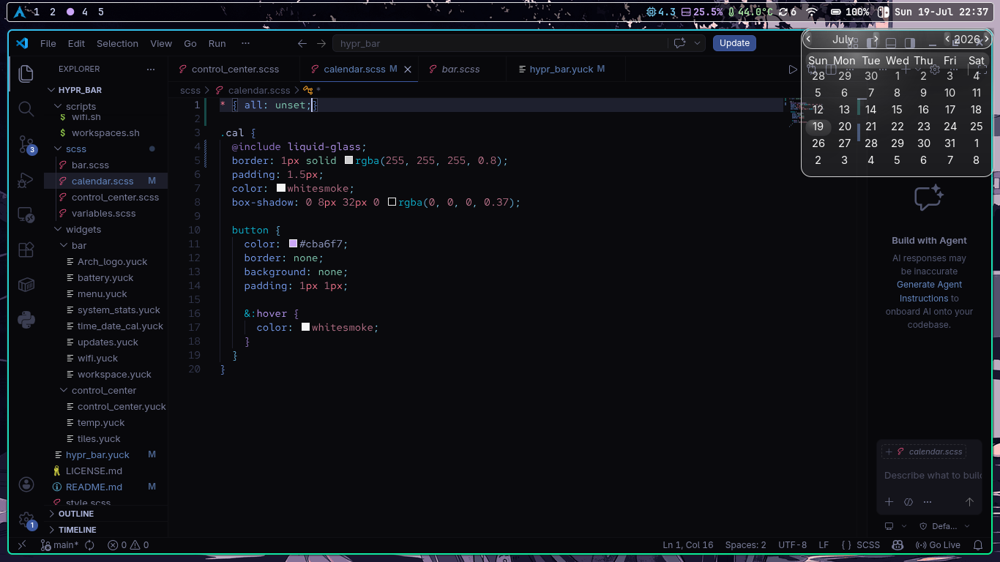
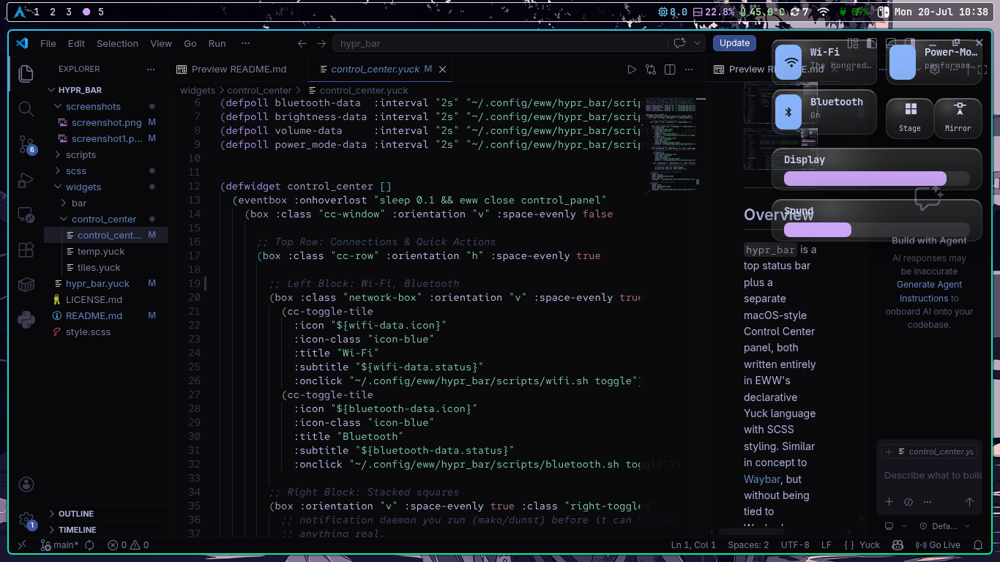

# hypr_bar [](https://opensource.org/licenses/MIT)

A personal status bar **and macOS-style Control Center** for [Hyprland](https://hyprland.org/), built with [EWW](https://github.com/elkowar/eww) (Elkowar's Wacky Widgets).

> **Note:** This is a personal configuration, not a general-purpose framework — no build step, no binary, no config-file format of its own. "Configuring" it means editing the `.yuck`/`.scss` files directly. It's designed to be used as a git submodule inside a dotfiles repo, living at `~/.config/eww/hypr_bar/`.




---

## Overview

`hypr_bar` is a top status bar plus a separate macOS-style Control Center panel, both written entirely in EWW's declarative Yuck language with SCSS styling. Similar in concept to [Waybar](https://github.com/Alexays/Waybar), but without being tied to Waybar's component model — every widget is a plain shell script feeding a `defpoll`/`deflisten`, rendered by a `defwidget`, styled in SCSS.

**Compatibility is narrow by design:** this is built specifically for Hyprland's Lua config system (`hyprland.lua`, Hyprland 0.55+). See [Compatibility](#compatibility) for exactly why it won't run under i3, GNOME, or KDE as-is.

---

## Features

- Workspace switcher (1–5 always shown, plus any extra open ones), system stats (CPU/RAM/temp), pending-updates count, Wi-Fi, battery with low-battery popup, and a live clock with a liquid-glass, interactive calendar popup.
- A macOS-style **Control Center** panel: Wi-Fi, Bluetooth, a 3-state Power Mode toggle, and Display/Sound sliders — all wired to real system state, styled with a "liquid glass" translucent effect.
- Every widget is independently modular — one script + one widget file per concern, decomposed into a subfolder only once a feature grows enough files to need it (see [Project Structure](#project-structure)).
- No `jq` dependency — all JSON is built and parsed with `awk`/`grep`/`sed`.

---

## Built With

- **Config language:** [Yuck](https://elkowar.github.io/eww/configuration.html) (EWW's own Lisp-like declarative format) + SCSS
- **Widget engine:** [EWW](https://github.com/elkowar/eww) (wayland branch)
- **Compositor:** [Hyprland](https://hyprland.org/) 0.55+, Lua config (`hyprland.lua`)
- **Backing tools:** `nmcli`, `bluetoothctl`, `brightnessctl`, `wpctl` (PipeWire), `tlpctl` (`tlp-pd`), `upower`, `socat`, `lm_sensors`, `pacman`/`yay` — see [Prerequisites](#prerequisites)

---

## Getting Started

### Prerequisites

**Required:**
- [`eww`](https://github.com/elkowar/eww) — the widget daemon (wayland branch)
- `hyprctl` — part of Hyprland; used for workspace data
- `nmcli` — NetworkManager CLI; used by the WiFi widget (bar icon **and** Control Center tile)
- `bluetoothctl` — BlueZ CLI; used by the Bluetooth tile
- `brightnessctl` — used by the Display slider
- `wpctl` — PipeWire CLI; used by the Sound slider
- `tlpctl` (from the **`tlp-pd`** package) — used by the Power Mode tile. This is the D-Bus client, not `tlp` itself — see [Modules → Control Center](#control-center) for why
- `socat` — used by `workspaces.sh` to listen on Hyprland's event socket
- `upower` — used by `battery.sh`'s event listener
- `lm_sensors` — provides the `sensors` command for CPU temperature
- `bash`, `awk`, `grep`, `sed`, `free`, `top`, `date`, `flock` — standard coreutils / util-linux
- A [Nerd Font](https://www.nerdfonts.com/) — all icons are Nerd Font glyphs

**For the updates widget:**
- `pacman` — Arch Linux package manager
- `yay` — AUR helper (replaceable with `paru` or any `-Qu`-compatible helper)

### Installation

**As a submodule (recommended):**
```bash
git submodule add https://github.com/Vishwajeet-keni/hypr_bar.git path/to/.config/eww/hypr_bar
```
```lisp
; ~/.config/eww/eww.yuck
(include "hypr_bar/hypr_bar.yuck")
```
```scss
// ~/.config/eww/eww.scss
@use 'hypr_bar/style.scss';
```

**Standalone clone:**
```bash
git clone https://github.com/Vishwajeet-keni/hypr_bar.git ~/.config/eww/hypr_bar
```
Then create the two root files above by hand.

**Make scripts executable** (easy to forget — a missing `chmod +x` fails silently, just showing a widget stuck with no data):
```bash
chmod +x ~/.config/eww/hypr_bar/scripts/*.sh
```

### Running

Hyprland 0.55+ uses `hyprland.lua` instead of the old `hyprland.conf` ini syntax:

```lua
-- Autostart
hl.on("hyprland.start", function()
  hl.exec_cmd("eww daemon")
  hl.exec_cmd("eww open hypr_bar")
end)

-- Reload keybind
hl.bind("SUPER + R", hl.dsp.exec_cmd("~/.config/scripts/reload.sh"))
```

`reload.sh`:
```bash
#!/bin/bash
eww kill
eww open hypr_bar
```

**Blur, for the liquid-glass Control Center:**
```lua
hl.config({
  decoration = { blur = { enabled = true, size = 6, passes = 3 } }
})

hl.layer_rule({
  match = { namespace = "eww" },
  blur = true,
  ignore_alpha = 0.5,  -- lets blur show through the semi-transparent glass panels
})
```
This only takes effect if every `defwindow` in `hypr_bar.yuck` explicitly sets `:namespace "eww"` — see [Modules → Control Center](#control-center).

---

## Configuration

There's no config file — you edit the source directly:

- **Poll intervals:** edit `:interval` on the relevant `defpoll`. `wifi-data` is `1s`; `bluetooth-data`/`brightness-data`/`volume-data` are `2s`.
- **Color theme:** shared tokens live in `scss/variables.scss` (`$accent-mauve`, `$accent-blue`, `$text-primary`, `$text-muted`, `$bg-dark`) — remap those and both the bar and Control Center follow.
- **AUR helper:** replace `yay` in `scripts/updates.sh` with `paru` or any `-Qu`-compatible helper.
- **CPU sensor:** see `scripts/system_stats.sh`; AMD systems typically use `k10temp` instead of `coretemp-isa-0000`.
- **Battery device:** run `ls /sys/class/power_supply/` to find your battery name (e.g. `BAT1`), then update paths in `scripts/battery.sh`.
- **Already running GNOME/KDE's `power-profiles-daemon`?** You cannot run `tlp-pd` alongside it — disable one before installing the other (see [Compatibility](#compatibility)).
- **Monitor placement:** add `:monitor` to a `defwindow` in `hypr_bar.yuck`.

---

## Modules

### Bar (left → right)

| Widget | Backing tool | Behavior |
|---|---|---|
| Arch Logo | — | Static, cosmetic only |
| Workspaces | `hyprctl` + Hyprland event socket | 1–5 always shown + any extra open; click to switch |
| System Stats | `sensors`, `/proc` | CPU %, RAM %, CPU temp, color-coded by state |
| Updates | `pacman`/`yay` | Pending update count; hover shows pacman/AUR split |
| WiFi | `nmcli` | Click to toggle; hover shows SSID |
| Battery | sysfs + `upower` | Icon + %; low-battery popup at ≤30% while discharging |
| Control Center button | — | Opens the panel below |
| Time / Date | EWW's `EWW_TIME` | Hover opens a liquid-glass calendar popup |

### Control Center

| Tile | Backing tool | Behavior |
|---|---|---|
| Wi-Fi | `nmcli` (same `wifi-data` the bar icon uses) | Click to toggle |
| Bluetooth | `bluetoothctl` | Click to toggle |
| Focus | — | Static placeholder — needs a notification-daemon target (mako/dunst) to wire up |
| Stage / Mirror | — | Static placeholders — no direct Linux equivalent |
| Power Mode | `tlpctl` (`tlp-pd`) | Click cycles `performance → balanced → power-saver → ...` |
| Display | `brightnessctl` | Slider, 0–100% |
| Sound | `wpctl` (PipeWire) | Slider, 0–100% |

Architecture behind these tiles — worth reading if you're extending them:

- **Reusable tiles, not copy-paste:** `tiles.yuck` defines three generic, data-agnostic widgets — `cc-toggle-tile [icon icon-class title subtitle onclick]`, `cc-icon-tile [icon title]`, `cc-slider [label value min max onchange]` — reused across all seven tiles instead of hand-writing each one.
- **Single source of truth for Wi-Fi:** `control_center.yuck` deliberately does *not* redefine `wifi-data` — it reuses the exact same `defpoll` the bar's own Wi-Fi icon reads, so the two can never drift out of sync.
- **Liquid glass:** `variables.scss`'s `liquid-glass` mixin gives every panel a soft radial sheen, a bright top rim + darker bottom inner shadow (for a sense of thickness), and a glow on the slider's active fill. GTK CSS only controls what's drawn *inside* the window though — actual blur is a compositor feature, which needed two separate fixes: (1) every `defwindow` needs an **explicit** `:namespace "eww"`, since EWW's default namespace isn't guaranteed to match a Hyprland layer rule; (2) the layer rule's `ignore_alpha` needs to be *high* enough (`0.5` here) to cover these panels' ~6–8% opacity — confirmed directly: `cal_popup`'s dedicated rule at `ignore_alpha = 0.1` left it unblurred, and raising it to `0.5` (matching `control_panel`'s rule) fixed it. Too low a threshold leaves those pixels being treated as "meant to be opaque" and skipped for blur.
- **Power Mode**, specifically: uses `tlpctl` (from the `tlp-pd` package), not `tlp` directly — almost every `tlp` subcommand needs root, including just reading status, which would mean either a sudo prompt breaking the UI or a sudoers file to maintain. `tlp-pd` runs as a D-Bus daemon `tlpctl` talks to over your session — no root needed, and `tlpctl get` reads live state directly, no local state file. It also guards against a real bug found while building it: **EWW/GTK can fire a single click's `onclick` more than once** (confirmed via debug logging — multiple PIDs spawned within the same millisecond for one physical click), which on a 3-state cycle can silently cancel out and make the toggle look "stuck." A non-blocking `flock` around the state-mutating section fixes this — a duplicate invocation arriving mid-transition just skips its own mutation instead of applying an unwanted extra step.

### Data flow — two patterns

Most widgets poll on a fixed interval:
```
shell script → JSON → defpoll (fixed interval) → defwidget
```
`workspaces.sh` and `battery.sh` instead use `deflisten`: emit once immediately, then block on a live source (Hyprland's IPC socket, or `upower --monitor`) and re-emit only on real change — instant updates, no wasted polling.

`battery.sh` combines both: the event listener reacts instantly to plug/unplug, but a background 30-second timer runs alongside it as a fallback, because `upower --monitor` fires on lots of properties that aren't the rounded percentage and was observed to leave the widget stale for ~20 minutes before jumping several % at once. The timer guarantees it can't go stale for more than 30s regardless of event sparsity.

### Calendar popup

Styled with the same `liquid-glass` mixin as the Control Center, but GTK's native `calendar` widget fought it harder than expected — its built-in theme paints its own background/border/font styling on internal nodes (`header`, `grid`, day labels) broadly enough that simply raising CSS specificity (e.g. `calendar.cal` instead of `.cal`) wasn't enough to fully override it. The actual fix is a targeted reset:

```scss
.cal * {
  all: unset;
}
```

`all: unset` strips every property GTK's theme sets on the calendar's descendants, before `.cal`'s own rules apply on top. **Scoped to `.cal *` deliberately** — a bare `* { all: unset; }` at the top of this file would reset *every element in the entire bar and Control Center*, since all `scss/` files are concatenated into one stylesheet by `style.scss`. This was caught and fixed before it shipped, but it's worth remembering if you're ever tempted to reach for `all: unset` elsewhere in this repo: always scope it to a specific ancestor class.

---

## Compatibility

**Short answer: Hyprland only.** Not a portability gap to fix later — several pieces are structurally tied to Hyprland.

**Hard blockers:**
- Workspace switching talks directly to Hyprland's own IPC socket/dispatcher syntax — i3 has a different IPC entirely; GNOME/KDE have no `hyprctl`.
- Blur is driven by `hyprland.lua`'s `hl.layer_rule`/`hl.config` — meaningless elsewhere.
- **GNOME won't render the bar correctly at all** — EWW's layer-shell windowing needs the Wayland `wlr-layer-shell` protocol, which GNOME's Mutter doesn't implement (same reason Waybar-style bars don't work under GNOME Wayland). KDE's KWin does support it on recent versions. i3 is X11-only, so layer-shell doesn't apply there at all.

**Soft blockers (Arch-specific, adaptable):** package names throughout are Arch package names; `updates.sh` is pacman/AUR-specific; `Arch_logo.yuck` is a cosmetic hardcoded glyph.

**Portable on their own:** `wifi.sh`, `bluetooth.sh`, `volume.sh`, `brightness.sh`, `battery.sh` don't care about DE/WM — only whether their CLI tool is installed.

**Extra gotcha:** `tlp-pd` exposes the same D-Bus interface as GNOME/KDE's built-in `power-profiles-daemon` — running both causes a conflict.

---

## Logging & Troubleshooting

**Bar doesn't appear** — `eww logs`; confirm the include path and repo location.

**Changes not reflected** — `eww kill && eww open hypr_bar`; EWW doesn't hot-reload.

**Widgets show no data** — confirm scripts are executable; test directly, e.g. `bash ~/.config/eww/hypr_bar/scripts/battery.sh`.

**Workspace widget emits once, never updates** — check `socat` is installed (`which socat`); without it the socket connection fails silently.

**Battery widget stalls for long stretches, then jumps several %** — expected on some hardware given `upower`'s event granularity; this is why the 30s fallback timer exists. Confirm it hasn't been removed from the script.

**Control Center panel isn't actually blurred** — check (1) every `defwindow` has explicit `:namespace "eww"`, (2) try *raising* `ignore_alpha` (e.g. to `0.7`) — a threshold that's too low leaves your panel's semi-transparent pixels being treated as "meant to be opaque" and skipped for blur.

**Calendar popup shows GTK's default gray background instead of liquid glass** — this isn't a blur problem, it's GTK's own theme styling on the calendar's internal nodes fighting our CSS. See [Modules → Calendar popup](#calendar-popup) — the fix is a properly-scoped `.cal * { all: unset; }`, not just raising selector specificity.

**Power Mode tile seems "stuck"** — confirm you have the `flock`-guarded version of `power_mode.sh`; without it a single click can silently apply 2–3 transitions and land back where it started.

**`tlpctl` not found / tile shows `"mode":"unavailable"`** — confirm `tlp-pd` is installed and running: `systemctl status tlp-pd`. Conflicts with `power-profiles-daemon` if both are present.

**Package install fails with 404s from every mirror** — local pacman database out of sync, not a broken package. `sudo pacman -Syyu` (double-`y`), then retry; regenerate mirrorlist with `reflector` if still unreliable.

**Temperature shows nothing** — run `sensors`; AMD systems need `k10temp` instead of `coretemp-isa-0000` in `scripts/system_stats.sh`.

**Battery widget missing** — check `ls /sys/class/power_supply/`, update `BAT0` paths if named differently.

**Updates widget hangs EWW** — `yay -Qu` can be slow; wrapped in `timeout 30`.

**Calendar popup doesn't close cleanly** — the 0.3s `onhoverlost` delay is intentional; below ~0.1s it tends to close before your mouse arrives.

---

## Project Structure

```
~/.config/
├── eww/
│   ├── eww.yuck                          ← (include "hypr_bar/hypr_bar.yuck")
│   ├── eww.scss                          ← @use 'hypr_bar/style.scss'
│   └── hypr_bar/                         ← this repo (git submodule)
│       ├── hypr_bar.yuck                 # defwindow: hypr_bar, control_panel, low_batt_warning, cal_popup
│       ├── style.scss
│       ├── README.md
│       ├── LICENSE.md
│       ├── scss/
│       │   ├── variables.scss            # shared palette tokens + liquid-glass mixin
│       │   ├── bar.scss
│       │   ├── calendar.scss
│       │   └── control_center.scss
│       ├── widgets/
│       │   ├── Arch_logo.yuck
│       │   ├── battery.yuck
│       │   ├── menu.yuck
│       │   ├── system_stats.yuck
│       │   ├── temp.yuck
│       │   ├── time_date_cal.yuck
│       │   ├── updates.yuck
│       │   ├── wifi.yuck
│       │   ├── workspace.yuck
│       │   └── control_center/           # subfolder — this feature owns enough files to warrant it
│       │       ├── tiles.yuck            # reusable: cc-toggle-tile, cc-icon-tile, cc-slider
│       │       └── control_center.yuck   # composition + this feature's defpolls
│       └── scripts/
│           ├── battery.sh                # BAT0 level/status — event + 30s fallback poll
│           ├── bluetooth.sh              # bluetoothctl state/toggle
│           ├── brightness.sh             # brightnessctl get/set
│           ├── power_mode.sh             # tlpctl get/cycle (performance/balanced/power-saver)
│           ├── system_stats.sh           # CPU %, RAM %, CPU temp via sensors
│           ├── updates.sh                # Pending updates via pacman -Qu and yay -Qu
│           ├── volume.sh                 # wpctl get/set
│           ├── wifi.sh                   # WiFi status + toggle via nmcli (shared: bar + Control Center)
│           └── workspaces.sh             # Active + open workspaces — event + hyprctl
├── hypr/
│   └── hyprland.lua                      # exec/bind hooks launch eww + blur/layer rules
└── scripts/
    └── reload.sh                        # Super+R keybind — kills and reopens the bar
```

One file per widget is intentional — decompose into a subfolder only once a feature grows enough sub-files to clutter the flat listing otherwise, as `control_center/` did.

---

## Roadmap

Real open items from building this, not aspirational filler:
- Wire **Focus** to an actual notification daemon (mako or dunst — undecided).
- **Stage / Mirror** have no Linux equivalent; either repurpose these tiles for something real or remove them.
- Investigate *why* EWW/GTK double-fires `onclick` on the Power Mode tile — the `flock` guard masks the symptom but the root cause is still unconfirmed, and it may affect other toggle tiles less visibly (a 2-state toggle firing twice just looks like a no-op, not a visible "stuck" state).

---

## Contributing

This is a personal dotfiles config, not a general framework — not actively seeking outside contributions, but feel free to fork and adapt.

---

## License

MIT License — see [LICENSE.md](LICENSE.md) for details.
Copyright (c) 2026 Vishwajeet Keni

---

## Acknowledgements

- [EWW](https://github.com/elkowar/eww) by ElKowar — the widget framework
- [Hyprland](https://hyprland.org/) — the compositor
- [tlp-pd](https://archlinux.org/packages/extra/any/tlp-pd/) — power-profiles-daemon-compatible D-Bus interface for TLP
- [Catppuccin](https://github.com/catppuccin/catppuccin) — color palette
- [Nerd Fonts](https://www.nerdfonts.com/) — icons